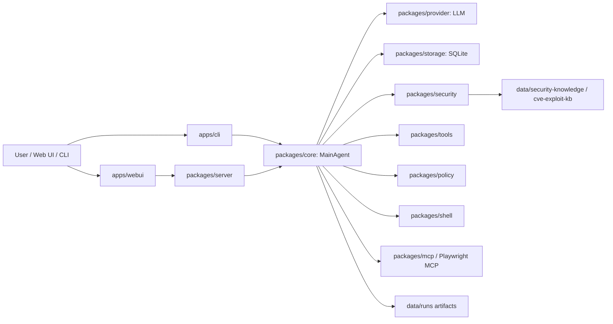
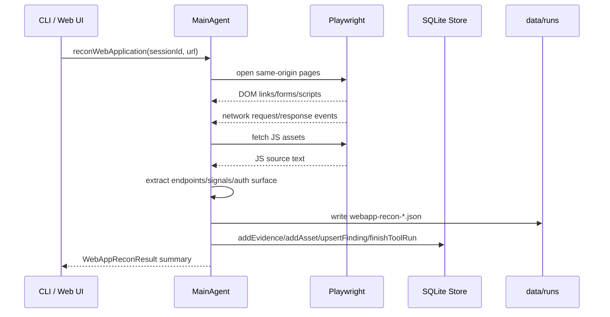

# AegisProbe 模块化开发交接文档

本文用于新开对话后继续开发 AegisProbe。目标是把当前项目从“CVE 匹配型脚本代理”升级为“证据驱动、应用理解优先、接近成熟渗透人员工作方式”的 Web 安全 agent。

## 1. 当前目标

AegisProbe 的下一阶段开发方向：

- 先理解目标 Web 应用，而不是先匹配 CVE。
- 先构建应用地图：页面、表单、JS 资产、运行时网络请求、API、认证面、业务流程。
- 再根据证据选择下一步：授权测试、业务逻辑验证、配置检查、组件/CVE 候选、主动验证。
- 所有结论必须可追溯到 evidence，不允许硬编码某个靶场、某个 CVE、某条固定流水线。

成熟项目对齐原则：

- OWASP WSTG：先识别入口点、参数、认证面、业务流程。
- Burp/ZAP：爬虫、被动分析、请求/响应证据、再进入主动验证。
- ProjectDiscovery Katana/Nuclei：先发现 URL/JS/API，再用模板做低影响验证。
- Playwright/CDP：用真实浏览器观察 SPA、DOM、运行时 fetch/XHR、登录行为。

## 2. 当前已完成能力

### 2.1 WebApp Recon Runtime

已新增 `webapp-recon`，这是现代 Web 应用的第一阶段证据采集能力。

命令：

```powershell
pnpm --filter @aegisprobe/cli dev webapp-recon <session-id> <url> --max-pages 10
```

输出：

- 同源页面、链接、表单、脚本资产。
- Playwright 运行时网络请求，包括 `fetch` / XHR。
- JS 源码中的接口候选、后台路由、source map、内部地址、debug flag、脱敏 secret-like 字符串。
- 合并后的 API inventory。
- 登录页、认证接口、密码表单、认证相关 storage key。
- JSON artifact：`data/runs/<session>/<workflow>/browser/webapp-recon-*.json`。

验证过的 smoke test：

```text
WebApp recon: pages=2 forms=1 api=9 jsEndpoints=3 network=5
auth surface: loginPages=1 authEndpoints=1 passwordForms=1
```

### 2.2 已接入的位置

- 类型定义：`packages/shared/src/index.ts`
- 浏览器侦察实现：`packages/core/src/security-browser.ts`
- MainAgent 方法：`packages/core/src/index.ts`
- 决策队列执行：`packages/core/src/security-execution.ts`
- 前端阶段队列项：`packages/security/src/decision-models.ts`
- Agent 决策提示词：`packages/core/src/decision-prompts.ts`
- CLI 命令入口：`apps/cli/src/index.ts`
- 文档：`README.md`、`ROADMAP.md`、`docs/security-agent-flow.md`

## 3. 总体架构



### 3.1 `apps/cli`

职责：

- 定义命令行入口。
- 创建 agent。
- 管理 config 路径、store、provider、skill registry、MCP。
- 暴露 `pentest`、`loop`、`browser-forms`、`webapp-recon`、`business-plan` 等命令。

重点文件：

- `apps/cli/src/index.ts`

新增命令：

```powershell
pnpm --filter @aegisprobe/cli dev webapp-recon <session-id> <url> --max-pages 10
```

### 3.2 `apps/webui` + `packages/server`

职责：

- 三栏前端 UI。
- 左侧项目/会话入口。
- 中间自然语言对话。
- 右侧实时渗透流程和终端输出。
- Server 负责 session/message/event API 和 WebSocket 事件流。

当前状态：

- UI 已可启动。
- 对话启动 bug 已修过：相对 `AEGISPROBE_CONFIG` 会解析到 repo root。
- 右侧流程目前依赖 agent events，但还没有专门渲染 `webapp-recon` artifact。

下一步建议：

- 把 `webapp-recon` 的 `apiInventory`、`authSurface`、`jsSensitiveSignals` 渲染到右侧执行流程。
- 不要预设固定渗透步骤；根据 evidence/tool run 动态渲染。

### 3.3 `packages/core`

职责：

- Agent 主运行时。
- 决策循环。
- 工具执行。
- 子 agent 编排。
- WebApp recon、业务逻辑、安全验证、报告等 runtime glue。

关键模块：

| 文件 | 职责 |
|---|---|
| `index.ts` | `MainAgent`，对外方法与依赖注入 |
| `pentest-runtime.ts` | 自主 pentest loop |
| `pentest-decision.ts` | 采样 LLM 决策 |
| `decision-prompts.ts` | 主 agent 与 pentest prompt |
| `security-browser.ts` | Playwright 浏览器能力，包括 `webapp-recon` |
| `security-execution.ts` | decision queue item 执行 |
| `security-business.ts` | 业务逻辑测试计划和认证上下文 |
| `security-probes.ts` | 内置 DNS/HTTP probe |
| `security-tooling.ts` | 工具运行、输出 artifact、归一化 |
| `tool-result.ts` | 结构化工具结果和失败 hint |
| `subagent-*` | 子 agent 角色、调度、执行、digest |

### 3.4 `packages/security`

职责：

- 安全数据模型。
- 决策队列。
- 工具 adapter。
- graph、goal model、CVE、OWASP、业务逻辑知识库。

关键模块：

| 文件 | 职责 |
|---|---|
| `types.ts` | 安全相关类型 |
| `decision-models.ts` | `buildSecurityDecisionQueue`，决定下一步 |
| `adapters.ts` | 外部安全工具适配器 |
| `normalizer.ts` | 工具输出归一化 |
| `exploit-knowledge.ts` | CVE/exploit KB 匹配 |
| `wappalyzer.ts` | 指纹识别 |
| `goal-model.ts` | 终止/覆盖度判断 |
| `graph.ts` / `graph-types.ts` | evidence/hypothesis graph |

当前关键行为：

- 有 live URL 后，decision queue 会优先产生 `webapp-recon`。
- 只有有证据后才进入 CVE、nuclei、业务逻辑或主动验证。

### 3.5 `packages/shared`

职责：

- 跨包类型。
- 通用工具函数。

本阶段新增类型：

- `BrowserNetworkRequest`
- `JsEndpointCandidate`
- `JsSensitiveSignal`
- `AuthSurfaceModel`
- `WebAppReconResult`

### 3.6 `packages/storage`

职责：

- SQLite audit trail。
- session、message、event、evidence、finding、asset、technology、tool run、auth context 等持久化。

开发要求：

- 新模块产出的重要结果必须写入 store。
- artifact 可以写文件，但必须把 artifact path 和摘要写入 evidence/tool run。

## 4. WebApp Recon 数据流



## 5. 当前设计约束

必须遵守：

- 不允许硬编码某个靶场、CVE、路径或固定攻击流水线。
- 修改关键模块前，要先参考成熟项目/官方文档做法。
- 工具输出必须结构化，失败要有 hint，避免重复错误命令。
- 主动验证必须受 scope 和 approval 控制。
- 对 secret-like 字符串只记录脱敏证据，不把完整 secret 写入报告摘要。
- 浏览器 APIs 可能抛 `SecurityError`，如 `localStorage` / `document.cookie`，必须容错。
- `webapp-recon` 默认只读，不提交表单，不点击危险动作。

## 6. 下一阶段模块拆分建议

### 6.1 API Inventory Normalizer

目标：

- 把 `apiInventory` 从 URL 列表升级成 API 形状。
- 归一化 path template：`/api/users/123` -> `/api/users/{id}`。
- 聚合 method、source、参数名、样例请求、认证需求、状态码、content-type。

建议新文件：

- `packages/core/src/webapp-api-inventory.ts`
- 或 `packages/security/src/api-inventory.ts`

输入：

- `WebAppReconResult`

输出：

```ts
type NormalizedApiEndpoint = {
  id: string;
  method: string;
  pathTemplate: string;
  examples: string[];
  queryParams: string[];
  bodyParamHints: string[];
  sources: Array<"form" | "script" | "network" | "resource" | "link">;
  authRequired: "unknown" | "likely" | "not_required";
  confidence: "low" | "medium" | "high";
  riskSignals: string[];
};
```

### 6.2 Auth Surface Analyzer

目标：

- 根据表单、storage、cookie、登录页、网络请求，建立认证模型。
- 判断登录、注册、找回密码、OAuth/SSO、JWT/session cookie、CSRF 迹象。

建议新文件：

- `packages/core/src/webapp-auth-surface.ts`

输出：

```ts
type AuthSurfaceAssessment = {
  login: "present" | "not_observed" | "unknown";
  sessionMechanism: Array<"cookie" | "jwt" | "localStorage" | "authorization-header" | "unknown">;
  csrfSignals: "present" | "missing_in_forms" | "unknown";
  highValueFlows: string[];
  nextEvidenceNeeded: string[];
};
```

### 6.3 Business Logic Planner

目标：

- 基于 API inventory 和 auth surface 生成业务逻辑测试计划。
- 不是直接攻击，而是生成“需要什么角色/账号/证据”的验证计划。

建议增强：

- `packages/core/src/security-business.ts`
- `packages/security/src/decision-models.ts`

输出示例：

- BOLA/IDOR 候选。
- Function-level authorization 候选。
- Workflow bypass 候选。
- Price/coupon/quantity/refund 候选。
- Race/replay 候选。

### 6.4 Source Map 与前端敏感信息模块

目标：

- 对 source map 做被动获取。
- 提取原始源码路径、API 常量、环境名、内部域名。
- 对 secret-like 字符串做 false-positive 分类。

建议新文件：

- `packages/core/src/webapp-source-map.ts`

注意：

- 默认不下载超大文件。
- secret 只脱敏存储。
- 完整值只能进本地 artifact，报告中不展示。

### 6.5 Web UI 渲染模块

目标：

- 右侧实时流程从 tool/evidence 动态生成，不预设步骤。
- `webapp-recon` 完成后显示：
  - 页面数
  - API 数
  - JS endpoint 数
  - auth surface
  - source map / secret-like signals

建议文件：

- `apps/webui/app.js`
- `apps/webui/style.css`
- `packages/server/src/index.ts`

## 7. 推荐开发顺序

1. `api-inventory` 归一化：让 API 不是散乱 URL。
2. `auth-surface` 分析：让 agent 知道登录/会话/角色边界。
3. `business-logic planner`：根据 API/auth 生成验证计划。
4. `Web UI artifact rendering`：把应用地图展示出来。
5. `authenticated comparison`：两个登录态对比 BOLA/IDOR。
6. `source-map passive analyzer`：增强前端泄露分析。

## 8. 验证命令

构建：

```powershell
pnpm --filter @aegisprobe/shared build
pnpm --filter @aegisprobe/security build
pnpm --filter @aegisprobe/core build
pnpm --filter @aegisprobe/cli build
```

启动 Web UI：

```powershell
pnpm webui
```

运行 WebApp recon：

```powershell
$env:AEGISPROBE_CONFIG="E:\My_working_space\aegisprobe\agent-pentest-assistant\configs\config.yaml"
pnpm --filter @aegisprobe/cli dev webapp-recon <session-id> http://127.0.0.1:8000/ --max-pages 10
```

如果没有 session，可以先通过 Web UI 或 `pentest <target> --yes` 创建 session。也可以临时用 `MainAgent.createSession()` 创建，但正式测试建议走 CLI/Web UI。

## 9. 新对话可复制提示词

### 9.1 总提示词

```text
你现在继续开发 E:\My_working_space\aegisprobe\agent-pentest-assistant。

目标：把 AegisProbe 从 CVE-first 的脚本型 agent 升级为成熟 Web 渗透人员式的证据驱动 agent。必须先理解 Web 应用，再决定测试路径。

请先阅读 docs/modular-development-handoff.zh-CN.md、docs/security-agent-flow.md、ROADMAP.md，然后开始开发下一阶段。

当前已完成：
- webapp-recon 已实现并接入 CLI / MainAgent / decision queue。
- 它能采集页面、表单、JS、运行时网络请求、JS endpoint、API inventory、auth surface、source-map 和脱敏 secret-like signals。
- 相关文件：
  - packages/shared/src/index.ts
  - packages/core/src/security-browser.ts
  - packages/core/src/index.ts
  - packages/core/src/security-execution.ts
  - packages/security/src/decision-models.ts
  - packages/core/src/decision-prompts.ts
  - apps/cli/src/index.ts

下一步请优先做 API Inventory Normalizer：
1. 不要硬编码靶场或 CVE。
2. 修改前先查成熟项目/官方文档如何做 API discovery / request clustering / route normalization。
3. 输入 WebAppReconResult，输出 NormalizedApiEndpoint 列表。
4. 聚合 method、path template、query params、body hints、sources、authRequired、confidence、riskSignals。
5. 写入 artifact 和 SQLite evidence/assets/finding 摘要。
6. 接入 decision queue，让后续 business logic planner 使用归一化 API，而不是原始 URL 列表。
7. 构建通过，并用临时本地页面或本地靶场做 smoke test。
```

### 9.2 Web UI 继续开发提示词

```text
继续开发 AegisProbe Web UI。

要求：
- 保持三栏布局：左侧工作目录/会话/CVE入口，中间自然语言对话，右侧实时流程和终端。
- 不要预设固定渗透步骤；右侧流程必须根据真实 agent events、tool runs、evidence 动态渲染。
- 新增 webapp-recon artifact 展示：
  - pages count
  - API inventory count
  - JS endpoints count
  - auth surface
  - source-map / secret-like signals
- 盒子不要大圆角，不要强高光，保持小而精致的暗色控制台风格。
- 修改前先读 apps/webui/app.js、apps/webui/style.css、packages/server/src/index.ts。
- 完成后启动 http://127.0.0.1:3000/ 并用浏览器验证。
```

### 9.3 Auth / Business Logic 继续开发提示词

```text
继续开发 AegisProbe 的认证面和业务逻辑测试计划。

输入来源：
- WebAppReconResult.authSurface
- API inventory / NormalizedApiEndpoint
- SecurityAuthContext / Playwright storage state

目标：
- 建立 AuthSurfaceAssessment。
- 根据 API 与认证面生成 BusinessLogicTestPlan。
- 不主动攻击，不提交危险表单，只生成证据需求和安全验证计划。
- 支持后续两个登录态对比 BOLA/IDOR、function-level authorization、workflow bypass。

要求：
- 不硬编码靶场。
- 先参考 OWASP WSTG、OWASP API Security Top 10、Burp/ZAP 对认证/授权测试的成熟做法。
- 所有计划项必须说明 evidence、precondition、safe validation boundary、stop condition。
```

## 10. 当前风险和注意点

- 工作区有大量未提交改动和 untracked 文件，不要随意清理。
- 不要 `git reset --hard` 或还原用户改动。
- `docker compose` 在本机有时不稳定，Vulhub 测试优先用已验证的单容器 fallback。
- CLI dev 可能从 `apps/cli` 作为 cwd 启动，配置路径要用绝对 `AEGISPROBE_CONFIG`。
- Playwright 对 `localStorage` / `document.cookie` 可能抛 `SecurityError`，必须容错。
- `httpx` 可能解析到 Python 包，不一定是 ProjectDiscovery httpx。
- `webapp-recon` 是只读浏览器侦察，不应点击破坏性按钮或提交表单。

